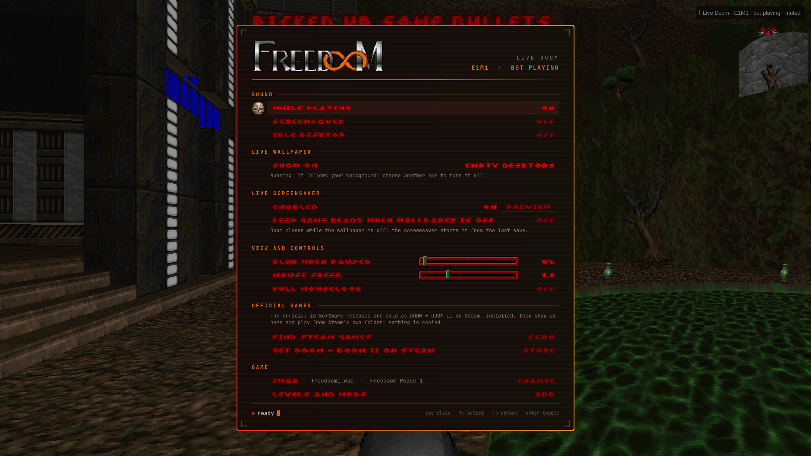

# Live Doom

**A bot plays Doom live on your Omarchy desktop, and as your screensaver, until you click in and take over.**



When a workspace is empty, the background is a real game of Doom, played by a bot. Click the game and you're playing that same game, from exactly where the bot was. Press F12 and the bot carries on. Turn on the live screensaver and, when the screen idles, the same game becomes your screensaver. Open a window and the game pauses behind it.

It's useless and it's fun as hell.

- Plays your own **official DOOM games from Steam** (DOOM + DOOM II, Final DOOM, Master Levels, No Rest for the Living, SIGIL), the free **DOOM shareware episode**, or **Freedoom**.
- A Doom-styled settings menu: right-click the live background, or open **Live Doom** from Apps. Its lettering, skull cursor and sliders come from the game you're playing.
- Works with any Omarchy theme: add the live background to the theme you already use.
- Write your own bot in any language: there's a small Python SDK and two examples.

## Requirements

- Omarchy (Hyprland 0.56 or newer, with the Quickshell-based Omarchy shell) on x86_64. Other architectures are untested.
- About 2 GB of free disk space for the one-time engine build. The build output lives in `~/.local/share/live-doom` and `~/.cache/live-doom`, not in the plugin folder.
- Build tools. The setup step below installs them with `omarchy pkg add`.
- XDG data, cache, config and state directories inside your home folder (the defaults). The installer refuses folders outside it, so its record of what it changed stays safe.

## Install

Live Doom builds its game engine on your machine, so it needs a one-time manual setup after the plugin is added. If any of the build tools are missing (often just `cmake`), `omarchy pkg add` asks for your password to install them, so run it in a terminal. If they're all installed already, it does nothing.

```bash
omarchy plugin add https://github.com/slogonomo/live-doom.git
cd ~/.config/omarchy/plugins/io.github.slogonomo.live-doom
omarchy pkg add base-devel cmake git sdl2-compat wayland libxkbcommon cairo pkgconf python-gobject gtk3
scripts/bootstrap.sh --fetch-sources --fetch-freedoom   # pinned engine sources + Freedoom, the free default game
scripts/build.sh                                        # build the engine and the background viewer
python3 -B scripts/install.py                           # shows exactly what it will change, then asks
```

The two `--fetch-…` flags are the only downloads setup makes:
- `--fetch-sources` clones the engine sources at pinned, full Git commits.
- `--fetch-freedoom` downloads Freedoom and checks it against a pinned SHA-256 hash.

Nothing else is downloaded unless you ask. `install.py --dry-run` only prints the plan, and `--yes` skips the question.

When setup finishes the first time, Live Doom opens a short guide in its own window. Nothing changes until you press **Finish**, except the game you pick in step 2 (including a download you accept), which applies straight away:

1. **Live Background.** Add the live background to your current theme, install the Phobos theme with it already selected, or skip it for now.
2. **Choose your DOOM.** Only shown when no official game was found. Freedoom is selected; you can download the free DOOM shareware episode instead, after reading and accepting id Software's terms. If you have DOOM from Steam, it's already selected and this step is skipped.
3. **Live Screensaver.** Chosen by default, but nothing changes until you press **Finish**; untick it to keep Omarchy's own screensaver. **Preview** shows what it looks like.
4. **Your setup**: a summary, then **Finish**. The full menu takes over from there.

**Skip setup**, at the bottom of each step before the summary, goes straight to the full menu and changes nothing.

## Using it

| Action | Control |
| --- | --- |
| Take over from the bot | Left-click the game on an empty desktop |
| Move | W, A, S, D or arrow keys |
| Look | Mouse |
| Fire | Left mouse button or Ctrl |
| Open a door or press a switch | E or Space |
| Run | Shift |
| Doom's own menu | Esc |
| Hand control back to the bot | F12 |
| Live Doom settings | Right-click the live background, or open **Live Doom** from Apps (it opens as a window) |

- **Live background.** The game shows while the selected background is a Live Doom one. Pick any other background and Doom saves, closes and gets out of the way; pick Live Doom again and it resumes. **Show on** chooses between empty desktops only, where a busy desktop holds its last frame and the game pauses, and all desktops, where the game keeps playing behind your windows. There, **Behind windows** chooses **Light** (the default: it redraws about 9 times a second instead of 35, to keep the work for your compositor and GPU low, while the game, the bot and the sound run at full speed) or **Full speed**. **Blur when paused** softens a frozen frame.
- **Screensaver.** Off until you turn it on, in setup or with **Live screensaver > Enabled** in the menu. Then, when Omarchy's screensaver would start, Live Doom shows the same game instead. Any input dismisses it, and screensaver input never steers the game. Omarchy still decides when to lock: lock timing, stay-awake and wake are unchanged. While Live Doom's screensaver is on, it holds Omarchy's screensaver switch, so Omarchy's **Trigger > Toggle > Screensaver** reads as off. Using that toggle hands the screensaver back to Omarchy's own, and Live Doom's turns off.
- **Sound.** Three settings: while you're playing (on), on the screensaver (off), and while the bot plays on an idle desktop (off). Locking the session mutes and pauses the game.
- **Progress.** Each game, meaning each set of game files, keeps its own saved progress. Checkpoints are written every 30 seconds and when the game closes.
- **Stuck bot.** After 25 seconds of play without reaching new ground or picking anything up, the bot replans on its own, and **Reroute bot** in the menu makes it replan straight away. AutoDoom doesn't do running jumps, so a ledge that needs one can leave it shuffling in place.

## Games

- **Official games.** Installed Steam releases are found automatically, and **Find Steam games** in the menu looks again. They play straight from Steam's own folder, and nothing is copied. Supported here: DOOM, DOOM II, No Rest for the Living, Master Levels, TNT: Evilution, The Plutonia Experiment, SIGIL and SIGIL II. Legacy of Rust is listed but can't run on this engine, which lacks ID24 support. Don't have them? [DOOM + DOOM II on Steam](https://store.steampowered.com/app/2280/DOOM__DOOM_II/) has them all.
- **DOOM shareware episode** (Knee-Deep in the Dead). Free from id Software. It's downloaded only after you accept id's terms in the menu (in setup, or under **Free games**), from Debian's unmodified archive, and checked by hash. You can also download it with `scripts/doomctl download-shareware --accept-terms`.
- **Freedoom.** Free, open-source games made for Doom engines. It's the default when nothing else is installed, and **Free games** in the menu switches back to it.
- **Your own files.** **IWAD** picks any complete Doom or Doom II game file, and **Levels and mods** adds custom WADs in load order. The shareware episode doesn't allow extra levels.

## Themes

- **Use Doom with this theme** adds the Live Doom background to whichever theme you're using, keeping its colours, and selects it. **Remove Doom from this theme** takes it out again, and the image can be recovered.
- **Phobos** is a Doom-red Omarchy theme whose first background is Live Doom. It's published separately from this plugin; setup offers to install it, and so does **Install our Phobos theme** under **Live background** in the menu. Live Doom never removes or changes a theme by itself.

## Write your own bot

Any program can drive the game in place of AutoDoom: you, then your bot, then AutoDoom, in that order of priority. It reads the same frames and game state the live background shows and sends simple actions (move, strafe, turn, fire, use, run, weapon). If it stops answering, the player stops within half a second of game time and AutoDoom takes over, normally in about a second. Bots get game input only: never the console, menus, saves or settings.

Two examples come installed in `~/.config/live-doom/agents/`. Choose one under **Game > Driver** in the menu:

- `example-unstick`: AutoDoom plays, and Unstick steps in when it makes no progress for 10 seconds. It probes for a way out, then hands back. It's a helper example: it can't escape a room that has no exit.
- `example-wander`: a minimal template to start from. If you edit an installed example, updates keep your edits (`install.py --replace-modified` takes the new version instead). Copying it to a new folder under `~/.config/live-doom/agents/` keeps your bot separate from the examples.

```python
from doomagent import Agent

with Agent("MyBot") as agent:
    while agent.connected:
        obs = agent.next_observation(pixels=False)      # waits for the next game tic
        if obs and agent.driving:
            agent.act(move=1, turn=3 if obs.health < 50 else 0)
```

The SDK is [`sdk/python/doomagent.py`](sdk/python/doomagent.py): standard-library Python, with numpy optional for images. [`sdk/python/doomagent_fake.py`](sdk/python/doomagent_fake.py) is a stand-in game for developing without Doom running. The protocol, for any language, is in [docs/design/EXTERNAL-AGENT.md](docs/design/EXTERNAL-AGENT.md). Training (seeded resets and exact stepping) isn't part of this: train elsewhere, for example in ViZDoom, then run the policy here.

## Update

```bash
omarchy plugin update io.github.slogonomo.live-doom
cd ~/.config/omarchy/plugins/io.github.slogonomo.live-doom
scripts/bootstrap.sh --fetch-sources --fetch-freedoom   # reuses what's already downloaded
scripts/build.sh
python3 -B scripts/install.py
omarchy restart shell                                   # loads the new menu code
```

If the game is loaded and active when you update (the bot playing, or you playing), pause it first. If you're playing, press F12 to hand back to the bot, then run `scripts/doomctl pause` before `install.py` and `scripts/doomctl resume` after it. With the live background off and the game closed, nothing needs pausing.

A source update stages and verifies its replacements first, keeps the previous source trees in `~/.local/share/live-doom/source-backups`, and refuses to overwrite local edits it doesn't recognise. If an older, differently patched engine tree has no ownership record, it's never overwritten: move `~/.local/share/live-doom/vendor` aside, then run `bootstrap.sh` again.

## Remove

Run the uninstaller **before** removing the plugin. `omarchy plugin remove` on its own deletes the plugin folder and stops Live Doom's processes. It leaves the user service unit and the launcher entry behind, and only the uninstaller removes those.

```bash
python3 -B ~/.config/omarchy/plugins/io.github.slogonomo.live-doom/scripts/uninstall.py
omarchy plugin remove io.github.slogonomo.live-doom
```

The uninstaller removes the integration: the service, the launcher entry, the example agents and their logs, the onboarding marker, the runtime folder and the screensaver claim. It keeps the engine build, its sources and downloads, your game files (Freedoom, the shareware episode and your own WADs), saved progress, settings, and anything you edited.

A Live Doom background you added to a theme stays in that theme's picker. Remove it first with **Remove Doom from this theme**, or delete `~/.config/omarchy/backgrounds/<theme>/1-live-doom*.webp` afterwards. For a full purge, also delete `~/.local/share/live-doom`, `~/.local/state/live-doom`, `~/.config/live-doom` and `~/.cache/live-doom`. Themes you installed, including Phobos, are never removed.

## What this installs and changes

- `~/.config/systemd/user/doom-desktop.service`: a user service that runs the game and the background viewer in your graphical session.
- `~/.local/share/applications/live-doom.desktop`: the **Live Doom** launcher entry.
- `~/.config/omarchy/shell.json`: enables this plugin.
- `live-doom` folders in your XDG data, cache, config and state directories (engine build, pinned sources, game files, saves, settings, logs), plus a private runtime folder, `$XDG_RUNTIME_DIR/live-doom` (mode 0700).
- Only after you turn the Live Doom screensaver on: while it's on, it holds Omarchy's screensaver-off toggle, so the stock terminal screensaver stays down. It never takes over a toggle you set yourself, and it releases the toggle when you turn its screensaver off, disable the plugin or uninstall.
- With **Use Doom with this theme**, a Live Doom background in that theme's personal backgrounds folder, `~/.config/omarchy/backgrounds/<theme>/`.

The installer shows these changes and asks before making them. It doesn't install or switch themes, and it doesn't change your idle timeouts, keybindings, bar or other plugins. Omarchy's own idle service stays in charge of timing.

## Troubleshooting

```bash
~/.config/omarchy/plugins/io.github.slogonomo.live-doom/scripts/doomctl status
systemctl --user status doom-desktop.service
journalctl --user -u doom-desktop.service
```

**Clicks or dropouts in audio through your monitor (NVIDIA, HDMI or DisplayPort).** NVIDIA cards change their memory clock as the load changes, and each change can briefly interrupt audio carried to a monitor, for any app, not just Live Doom. A live background behind windows makes the changes frequent. Live Doom keeps that load low (**Behind windows: Light**, or **Show on: Empty desktops**), but the reliable fix is to keep the memory clock out of its lowest steps. List your card's memory clocks with `nvidia-smi -q -d SUPPORTED_CLOCKS`, then, as an administrator, run `nvidia-smi --lock-memory-clocks=<middle step>,<highest step>` (for example `5001,9501` on an RTX 3080 Ti). It lasts until reboot; `nvidia-smi --reset-memory-clocks` undoes it. The graphics clock still idles normally, so the extra idle power is small.

Live Doom is a Linux and Omarchy integration. On a Mac it runs only under Omarchy itself: [Omarchy on Mac](https://omarchy.org/manual/mac-support/).

## Licences

Live Doom's own code is **0BSD** ([LICENSE](LICENSE)), and its original art is **CC0**. The desktop patch to the AutoDoom/Eternity engine, and any engine built from it, is **GPL-3.0-or-later**; the small audio patch to the bundled SDL2_mixer keeps SDL2_mixer's **zlib** licence. Game data is never included: official games stay © id Software / ZeniMax Media, and the shareware episode and Freedoom keep their own terms. Details and third-party notices are in [THIRD-PARTY-NOTICES.md](THIRD-PARTY-NOTICES.md).

Live Doom is an independent fan project. It isn't affiliated with or endorsed by id Software, ZeniMax or Bethesda; "DOOM" is their trademark and is used here only to say which game it plays.
